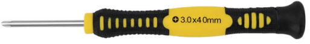

# **Keyestudio Electronic Parts DIY Kit For OTTO Robot Maker**

## 1.What is Otto DIY ?

Otto is an interactive robot that anyone can make! It is completely open source,
Arduino compatible and 3D printable.  
Otto is able to walk, dance, make sounds and avoid obstacles. His small body is
in the assembled size, with simple structure. The shelf parts are designed using
3D printer, simple electronics connections (almost no welding required), and
basic coding skills.  
Otto is designed using [Autodesk 123D
Design](https://tinkercad.com/things/1kI624iowUR) software. No need technical
knowledge, perfect for beginners. You are able to modify it or even recreate
them to make you own Otto robot and then share to the world!

## 2.Kit List

The kit includes everything you need to build your Otto in 1 hour:

NO SOLDERING REQUIRED!

Note: the print parts are Not Included!

| **No.** | **Component**                | **Quantity** | **Picture**                                                                                                                                               |
|---------|------------------------------|--------------|-----------------------------------------------------------------------------------------------------------------------------------------------------------|
| 1       | NANO Shield                  | 1            |                                                                                                            |
| 2       | Keyestudio Nano CH340        | 1            |                                                                                                            |
| 3       | HC-SR04 Ultrasound Sensor    | 1            |                                                                                                            |
| 4       | HC-06 Bluetooth Module       | 1            |                                                                                                            |
| 5       | Micro Servo 9G               | 4            |                                                                                                            |
| 6       | Passive Buzzer               | 1            |                                                                                                            |
| 7       | Phillips Screwdriver         | 1            |                                                                                                            |
| 8       | 200mm Black Connector Wire   | 2            |                                                                                                            |
| 9       | USB Cable                    | 1            |                                                                                                            |
| 10      | 200mm Red Connector Wire     | 2            |                                                                                                            |
| 11      | Female to Female Jumper Wire | 10           |                                                                                                            |
| 12      | Self-locking Push Switch     | 1            |                                                                                                            |
| 13      | M2\*12MM Round-head Screw    | 2            |                                                                                                            |
| 14      | M2 Nut                       | 2            |                                                                                                            |
| 15      | M2X5MM Tapping Screw         | 4            |                                                                                                            |
| 16      | 4 AA Battery Case with lead  | 1            |  |

## 3.3D Printing Parts

And then you only need to 3D print 6 parts in total:

-   3D printed head

-   3D printed body

-   3D printed leg x2

-   3D printed right foot

-   3D printed left foot

For the 3D printing parts, you can print them out with 3D printer.

That's all simple! [Download all .stl files here in
Thingiverse.](http://www.thingiverse.com/thing:1568652) If you do not have a 3d
printer, you can always use services like
[3dhubs.com](https://www.3dhubs.com/3d-printing) or local maker spaces.

## 4.Print Settings

Otto is very well designed for 3D printing, so won’t give you trouble if you
follow this common parameters:

-   Recommended to use a FDM 3D printer with PLA material.

-   No need supports or rafts at all.

-   Resolution: 0.15mm

-   Fill density: 20%

Notes:

You can print individually piece by piece to match the colors of the original
design or optionally print all at the same time in an area of 14cm x 14cm.

For slicing and generating the g code for the machine free **slicer software**
like Cura or FlashPrint that comes with the FlashForge Finder 3D printer that we
are using (If you are outsourcing the printing, no need to worry about it)

After printing, you will need to clean a little bit the legs and feet areas that
fix the motors.

## 5.Build Your Own Otto Robot:

#### Step1: Check Your Parts From Bottom to Top

Print the attached .pdf instructions manual for convenience:

[OTTO-DIY-Instruction-Manual](https://drive.google.com/open?id=1CDNzOiKPmGQcV_or11FTHmKeKFw4YQXI)

#### Step2: Foot Servos Assembly

Put the micro servo inside feet and then push it inside, if is to hard maybe
need to clean more the area with a cutter.

Is very important to check that the servo is able to rotate at 180 degrees to
each side.

After checking the movement, use only the small screw to fix it.

Same process for the other foot.

 

#### Step3: Fix Servos to Body

Take the other 2 micro servos put them in the defined locations in the 3D
printed body, and fix them only with screws.

#### Step4: Fix Legs to Body

Connect the legs to the hub of the micro servo, important like the foot servos,
you must check the legs are able to rotate 180 degrees each side respect to the
body.

After verifying the alignment, fix them using the small screws to the hole
inside the leg.

#### Step5: Fix Foot to Legs

****

Taking care of the cables as showed in the illustration, you should put the
cables inside the slots of the body passing through the hole of the legs.

Once they are in right position, use the pointed screws to fix them from the
back.

#### Step6: Head Assembly

****

Start from the ultrasound sensor is important to pull out the eyes to the limit.
Then put the Arduino nano in the shield, optionally you can weld the positive
cable of battery holder to **Vin** in the board and negative cable to any GND.

Insert diagonally the both boards together facing the USB conector to the hole
in the 3D printed head, then use the pointed screws to fix it.

#### Step7: Electric Connection

Prepare the jumper cables, buzzer, and switch.

Then follow the diagram pins numbers and make sure to put them in the right
position.

****

****

**Special note:**

1.  **When connecting the Bluetooth module, CANNOT directly plug into the
    shield. Or else, the space is not enough, should connect the Bluetooth
    module to the shield with male-to-female jumper wires. The jumper wires are
    Not Included in the kit list.**

2.  **When connecting well all the components and uploading the code, CANNOT
    press the button welded to battery case, that is, CANNOT supply the power;
    otherwise, code upload fails.**

#### Step8: Snap the Head

The Head has snap feature, take care of the cables and close it. Congrats!

#### Step9: Arduino Programming

For the coding part you will need to:

1.  Download and install Arduino softwareIDE:

[https://www.arduino.cc/en/Main/Software](%20https:/www.arduino.cc/en/Main/Software)

2.  Copy all libraries to C:/Users/user/Documents/Arduino/libraries (or wherever
    your library folder is installed)

3. Connect your Otto through USB (your computer should install the drivers)

4. Finally open OTTO_smooth_criminal.ino code and upload to your Arduino Nano
for dancing Otto mode.

5.  Try OTTO_avoid.ino for obstacle avoidance

More codes in <https://github.com/OttoDIY/>

You can always try different codes from the same Github repository to use the
ultrasound to avoid obstacles or detect objects and the buzzer to make sounds.
Include all main moves very easy to adjust speed, number of times and direction.

**Special note:**

This OTTO kit is similar to Keyestudio Frog Robot for Arduino Graphical
Programming kit(KS0446).

This OTTO kit contains a HC-06 Bluetooth module, using Bluetooth 2.0, only
compatible with Android phone. But frog robot kit contains a HM-10 Bluetooth
module, compatible with both Android and iOS phone.

When using, as long as the Bluetooth module is not involved, these two product
kits can use the common source code.

Check relevant info of frog robot kit from the link:

<https://wiki.keyestudio.com/KS0446_Keyestudio_Frog_Robot_for_Arduino_Graphical_Programming>

## 6.Resources

**Otto website:**  <https://www.ottodiy.com/>

**Tutorial from:**
[https://www.thingiverse.com/thing:1568652/\##files](https://www.thingiverse.com/thing:1568652/##files)

**Otto Instructions Manual and Otto DIY-AllFiles:**

<https://fs.keyestudio.com/KS0358>

**More Codes from:** <https://github.com/OttoDIY/DIY>
